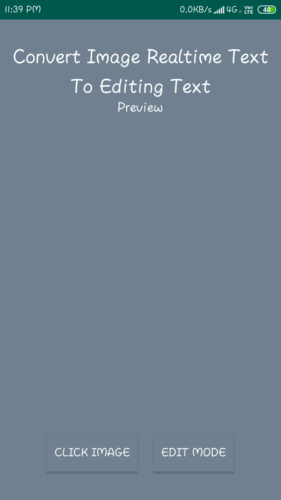
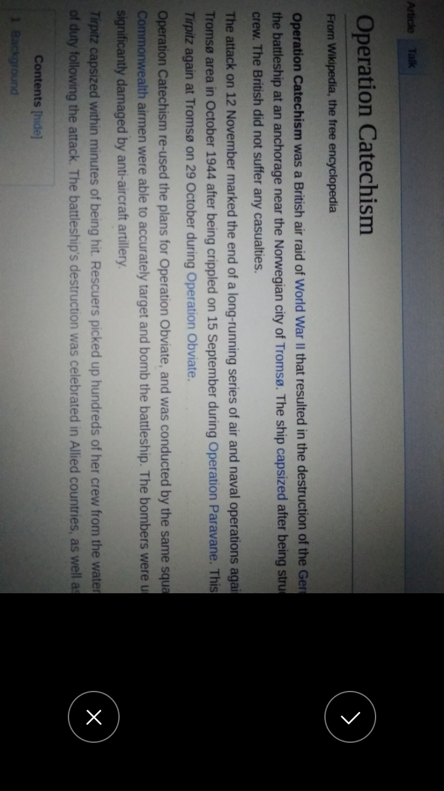
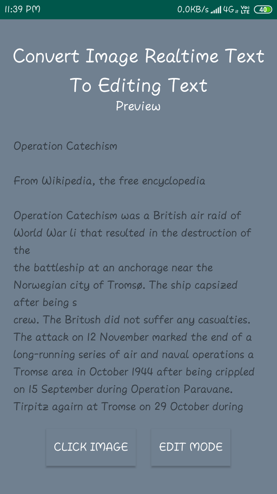
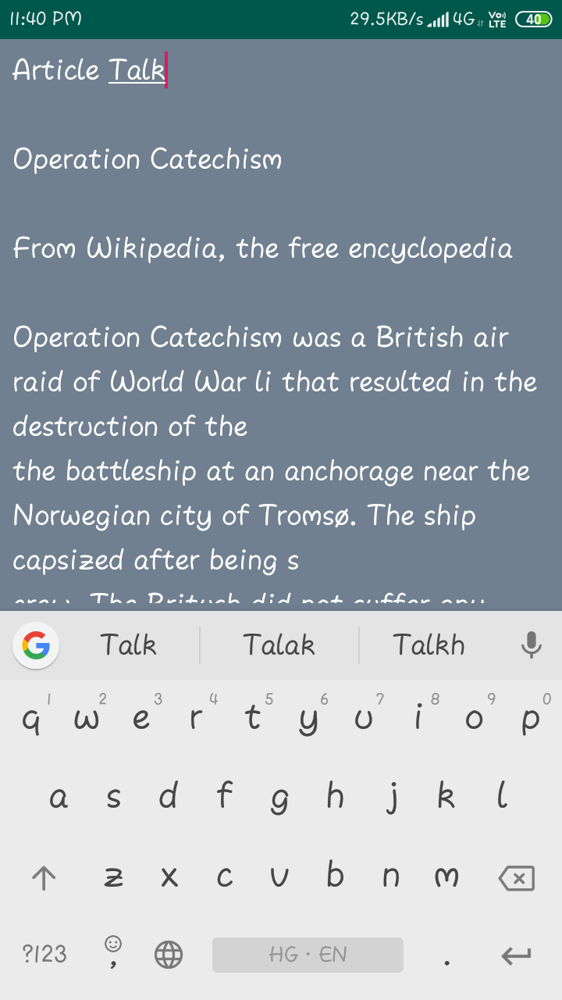

# Image-To-EditableText

## An Android Application Useful For Identifying Text in Images And Edit Them According To Need.

### Here are The Demo ScreenShots.

 <table>
      <tr>
       <td></td>
       <td></td>
      </tr>
  </table>
  
  
<table>
    <tr>
      <td></td>
       <td></td>
    </tr>
</table>
